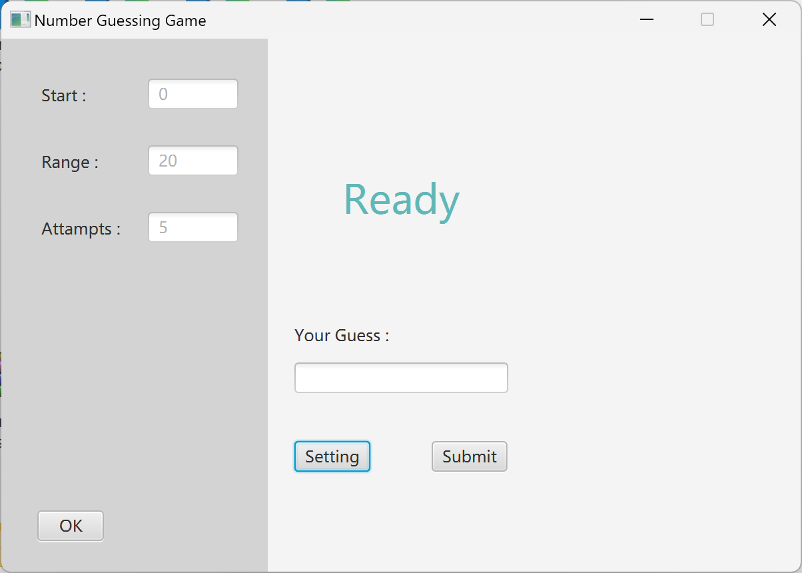

# Number Guessing 
## Introduction:
This is my Second JavaFX program: a classic game which people can guess the random number with the range.   
Find the executable application (number_guessing-fx.exe) from Google Drive:  
[Edmond's Java Program Collection.zip (Windows)](https://drive.google.com/file/d/1ve7sEscvtVldRKZU-B3VhaQdORteksQk/view?usp=drive_link)

## Snapshot

## Features
- Can set the range, attampts
- Foldable setting panel.

## Tech Stack 
| Type | Name |
| ----------- | ----------- 
| Programming Language | Java |
| GUI Library | Java FX |
| GUI Tool | Scene Builder|

## Run Instruction
### Requirement:
- Java Runtime Environment
- Java FX
### Steps:   
To run the application in your local machine, please follow the steps below:
1. Clone the repository from the github  
2. Add JavaFX to Build Path
3. Add the VM argrements to the run configure:  
`--module-path "<PATH TO YOUR JavaFX/lib>" --add-modules javafx.controls,javafx.fxml`
4. Run the *NumberGuessing_Main.java* in the *application* package.

## License
MIT